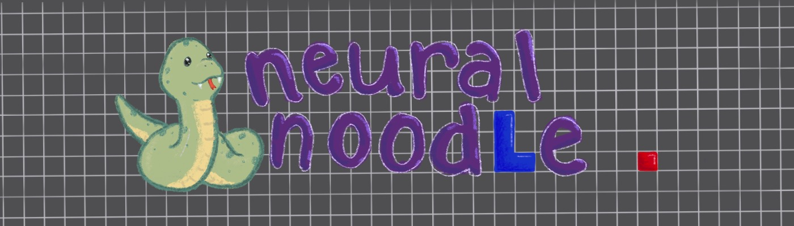
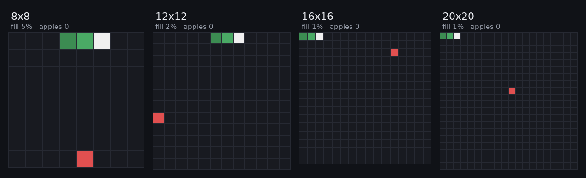

# Neural Noodle

A reinforcement learning agent that learns to play Snake, and an
honest look at how good (and how limited) it actually is.



That is a single trained agent playing four board sizes at once. It
clears the small boards, and you can watch it run out of room on the
big ones: 16x16 ends at 71 percent full, 20x20 at 22 percent. The
larger boards are sped up so all four finish together, and each panel
shows where it actually ended up.

## What this project is about

Snake is easy to "solve" in a boring way. Follow a fixed loop that
visits every square (a Hamiltonian cycle) and you never die and always
fill the board, so just winning is not interesting. The interesting
question is efficiency: how few steps does the agent take per apple,
and how much of the board can it fill, compared to that near-optimal
loop? And can one agent handle board sizes and shapes it never trained
on, where a hand-coded loop would not transfer?

Every result is measured against three reference points:

- The planner (the bar to beat): follows a Hamiltonian cycle with safe
  shortcuts, and wins every game on every board tested.
- A random policy (the floor): dies almost immediately.
- A looping agent (the trap): circles forever without chasing fruit,
  the classic "stay alive but never score" failure.

## How it does

On a 10x10 board the agent averages about 9 steps per apple while the
safe planner needs 15, so when it eats it is genuinely more efficient.
It just does not finish every game (it wins roughly 8 in 10 on 10x10,
nearly always on smaller boards), and it struggles to fill boards much
larger than it trained on. The full tables, plots, and a write-up live
in [docs/paper](docs/paper); every number traces back to
[results/ledger.jsonl](results/ledger.jsonl).

## What's in here

- `src/snake_rl`: the main package. Snake simulator (numpy and a GPU
  tensor version), the Hamiltonian planner, the PPO agent, the
  evaluation protocol, the results ledger, and plotting and video
  tools.
- `src/noodle`: the original human-playable Pygame game
  (`uv run python main.py`).
- `configs`: every experiment as a validated, hashed YAML config.
- `docs/adr`: architecture decision records.
- `journal`: experiment journal, one lesson per file.
- `results/ledger.jsonl`: every measured number, tagged with the exact
  config and commit it came from.

## Quick start

Requires [uv](https://docs.astral.sh/uv/).

```sh
uv sync
uv run pytest tests -q
uv run python -m snake_rl.eval_planner     # oracle reference numbers
uv run python -m snake_rl.train --config configs/main-10x10.yaml
uv run python -m snake_rl.plots --out plots
```

Checks: `uv run ruff check src/snake_rl tests`,
`uv run ruff format --check src/snake_rl tests`,
`uv run ty check src/snake_rl`.

## License

MIT. See [LICENSE](LICENSE).
